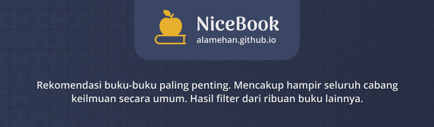

## NiceBook

- Rekomendasi buku-buku paling penting. Mencakup hampir seluruh cabang keilmuan secara umum 
- Merupakan salah satu personal project dari [alamehan.github.io](https://alamehan.github.io/) yang berfokus pada _book recommendation_

## Motivasi 

Buku menjadi salah satu sumber 'nutrisi' untuk otak kita. Dengan membaca buku kita banyak sekali mendapatkan manfaat, mulai dari pengetahuan yang bertambah, keterampilan yang semakin terasah, hingga membantu kita dalam mengambil beragam keputusan di kehidupan sehari-hari. Dengan membaca buku kita menjadi berilmu, dan dengan ilmu kehidupan kita menjadi lebih baik. Banyak sekali orang-orang hebat dan berprestasi diluar sana dimulai dari kecintaannya terhadap buku. Bahkan berdasarkan data, negara-negara maju yang tercatat saat ini memiliki satu kesamaan, yaitu tingkat literasi yang tinggi, minat membaca buku yang tinggi. Oleh karena itu penting sekali bagi kita untuk membiasakan membaca buku, mencintai ilmu.

Saat ini buku yang tersebar di seluruh penjuru dunia baik yang dicetak maupun digital sudah tak terhitung lagi jumlahnya. Hal ini terkadang membuat kita bingung untuk memilih mana saja buku yang memang berkulitas dan berbobot, dan mana pula yang tidak. Mengapa hal ini penting? karena 1 buku yang berkualitas dan berbobot bisa setara dengan 10 buku (atau bahkan lebih) yang memang biasa-biasa saja. Jadi selain memang dapat menghemat waktu dan tenaga, membaca buku yang berkualitas dan berbobot pun dapat lebih mencerahkan kita, ilmu yang didapat tidak simpang siur, tidak setengah-setengah, dan tentunya kita bisa lebih banyak mendapatkan manfaat.

**NiceBook** hadir untuk memberikan rekomendasi buku-buku terbaik yang mencakup hampir seluruh cabang keilmuan secara umum. **NiceBook** merupakan intisari dan hasil _filter_ secara manual dari ribuan buku-buku lainnya yang sejenis. Proses penyaringan buku ini sesungguhnya memakan banyak waktu, sehingga anda tidak perlu khawatir terkait rekomendasi buku yang diberikan sudah tentu berkualitas dan berbobot. **NiceBook** dapat anda gunakan sebagai "peta" ilmu pengetahuan karena mencakup hampir seluruh cabang keilmuan secara umum, bahkan sudah dikategorikan baik berdasarkan umur maupun jenis buku, jadi anda hanya perlu mimilih buku sesuai kebutuhan saja.

Semoga bermanfaat. Selamat menyelami lautan ilmu pengetahuan!

TOP 140 Buku Seri Orisinil
---

* Judul
  * [Detail](https://github.com/phillipadsmith/awesome-github)
  * [Detail](https://github.com/phillipadsmith/awesome-github)
  
* Judul
  * [Detail](https://github.com/phillipadsmith/awesome-github)
  * [Detail](https://github.com/phillipadsmith/awesome-github)
  
TOP 60 Buku Seri Yang Dikurasi Secara Manual
---

* Judul
  * [Detail](https://github.com/phillipadsmith/awesome-github)
  * [Detail](https://github.com/phillipadsmith/awesome-github)
  
* Judul
  * [Detail](https://github.com/phillipadsmith/awesome-github)
  * [Detail](https://github.com/phillipadsmith/awesome-github)

TOP 110 Buku Non-Seri
---

* Judul
  * [Detail](https://github.com/phillipadsmith/awesome-github)
  * [Detail](https://github.com/phillipadsmith/awesome-github)
  
* Judul
  * [Detail](https://github.com/phillipadsmith/awesome-github)
  * [Detail](https://github.com/phillipadsmith/awesome-github)
